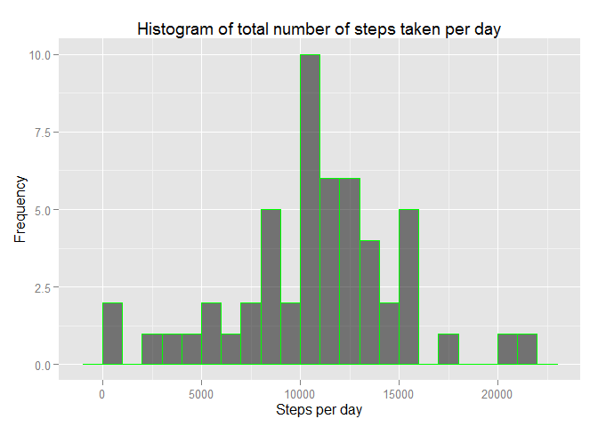
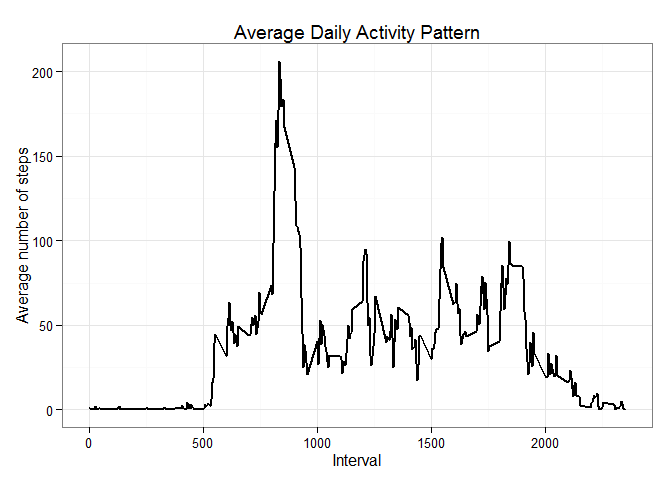
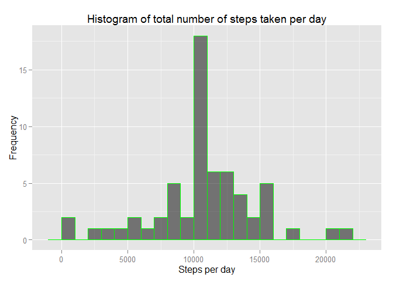
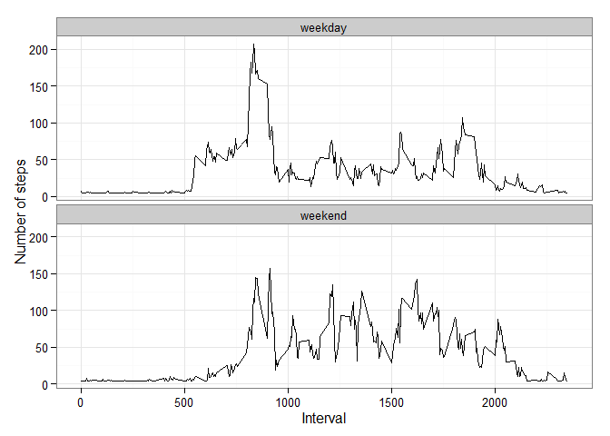

Coursera's Reproducible Research
================================
Peer Assessments 1
==================

## Loading and preprocessing the data

```r
library(knitr)
suppressPackageStartupMessages(library(dplyr))
library(ggplot2)
library(lubridate)

Sys.setlocale("LC_TIME","English")
```

```
## [1] "English_United States.1252"
```

```r
sessionInfo()
```

```
## R version 3.1.3 (2015-03-09)
## Platform: x86_64-w64-mingw32/x64 (64-bit)
## Running under: Windows 7 x64 (build 7601) Service Pack 1
## 
## locale:
## [1] LC_COLLATE=Norwegian (Bokmål)_Norway.1252 
## [2] LC_CTYPE=Norwegian (Bokmål)_Norway.1252   
## [3] LC_MONETARY=Norwegian (Bokmål)_Norway.1252
## [4] LC_NUMERIC=C                              
## [5] LC_TIME=English_United States.1252        
## 
## attached base packages:
## [1] stats     graphics  grDevices utils     datasets  methods   base     
## 
## other attached packages:
## [1] lubridate_1.3.3 ggplot2_1.0.1   dplyr_0.4.1     knitr_1.10     
## 
## loaded via a namespace (and not attached):
##  [1] assertthat_0.1   colorspace_1.2-6 DBI_0.3.1        digest_0.6.8    
##  [5] evaluate_0.7     grid_3.1.3       gtable_0.1.2     htmltools_0.2.6 
##  [9] magrittr_1.5     MASS_7.3-39      memoise_0.2.1    munsell_0.4.2   
## [13] parallel_3.1.3   plyr_1.8.1       proto_0.3-10     Rcpp_0.11.5     
## [17] reshape2_1.4.1   rmarkdown_0.5.1  scales_0.2.4     stringr_0.6.2   
## [21] tools_3.1.3      yaml_2.1.13
```

```r
### Making the job easier for my evaluaters
#opts_chunk$set(echo = TRUE, results = 'hold')
opts_chunk$set(echo = TRUE)
# Reading csv file
pa1_data <- read.csv('./activity.csv', header = TRUE, sep = ",", colClasses = c("numeric", "character", "numeric"))

# Converting the date field to Date class
pa1_data$date <- ymd(pa1_data$date)
```
## What is mean total number of steps taken per day?

```r
# Creating new dataset without missing values.
pa1_data1 <- na.omit(pa1_data)


# Calculating the total number of steps taken per day
steps_per_day_total <- pa1_data1 %>% group_by(date) %>% summarize(total_steps = sum(steps))
head(steps_per_day_total)
```

```
## Source: local data frame [6 x 2]
## 
##         date total_steps
## 1 2012-10-02         126
## 2 2012-10-03       11352
## 3 2012-10-04       12116
## 4 2012-10-05       13294
## 5 2012-10-06       15420
## 6 2012-10-07       11015
```

```r
# Make a histogram of the total number of steps taken each day
ggplot (steps_per_day_total, aes(total_steps))+
  geom_histogram(binwidth=1000, alpha=.5, position="identity", fill="black", col="green")+
  ggtitle ("Histogram of total number of steps taken per day")+
  xlab("Steps per day") + ylab("Frequency")
```

 

```r
# Calculate and report the mean and median of the total number of steps taken per day
summarise(steps_per_day_total, mean=mean(total_steps), median = median(total_steps))
```

```
## Source: local data frame [1 x 2]
## 
##       mean median
## 1 10766.19  10765
```

## What is the average daily activity pattern?


```r
# aggregate steps
steps_interval <- aggregate(steps ~ interval, data=pa1_data1, mean)
ggplot(steps_interval, aes(x=interval, y=steps)) +   
        geom_line(color="black", size=1) +  
        labs(title="Average Daily Activity Pattern", x="Interval", y="Average number of steps") +  
        theme_bw()
```

 

```r
# Which 5-minute interval, on average across all the days in the dataset, contains the maximum number of steps?
steps_interval[which.max(steps_interval$steps),]
```

```
##     interval    steps
## 104      835 206.1698
```
## Imputing missing values


```r
# 1.Calculate and report the total number of missing values in the dataset (i.e. the total number of rows with NAs)
sum(is.na(pa1_data))
```

```
## [1] 2304
```

```r
#2.Devise a strategy for filling in all of the missing values in the dataset. The strategy does not need to be sophisticated. #Using the mean of steps
mean_interval <- mean(pa1_data1$steps)

#3.Create a new dataset that is equal to the original dataset but with the missing data filled in.
pa1_data3 <- pa1_data
pa1_data_rows <- nrow(pa1_data3)

for ( i in 1:pa1_data_rows) {
  if (is.na(pa1_data3[i,1])){
    pa1_data3[i,1] = mean_interval
  } 
}
  
#4.Make a histogram of the total number of steps taken each day and Calculate and report the mean and median total number of #steps taken per day. Do these values differ from the estimates from the first part of the assignment? What is the impact of #imputing missing data on the estimates of the total daily number of steps?
steps_per_day_total_imputed <- pa1_data3 %>% group_by(date) %>% summarize(total_steps = sum(steps))
head(steps_per_day_total_imputed)
```

```
## Source: local data frame [6 x 2]
## 
##         date total_steps
## 1 2012-10-01    10766.19
## 2 2012-10-02      126.00
## 3 2012-10-03    11352.00
## 4 2012-10-04    12116.00
## 5 2012-10-05    13294.00
## 6 2012-10-06    15420.00
```

```r
# Make a histogram of the total number of steps taken each day
ggplot (steps_per_day_total_imputed, aes(total_steps))+
  geom_histogram(binwidth=1000, alpha=.5, position="identity", fill="black", col="green")+
  ggtitle ("Histogram of total number of steps taken per day")+
  xlab("Steps per day") + ylab("Frequency")
```

 

```r
summarise(steps_per_day_total_imputed, mean=mean(total_steps), median = median(total_steps))
```

```
## Source: local data frame [1 x 2]
## 
##       mean   median
## 1 10766.19 10766.19
```
## Are there differences in activity patterns between weekdays and weekends?


```r
pa1_data4 <- pa1_data3
identical(pa1_data4, pa1_data3)
```

```
## [1] TRUE
```

```r
# Creating a new column with weekdays' names.
pa1_data4 <- mutate(pa1_data4, weekday=weekdays(date))

# Creating a new factor variable in the dataset with two levels – “weekday” and “weekend” indicating whether a given date is a # weekday or weekend day.
# Tell R that weekday is nominal  by making it a factor.
pa1_data4$weekday <- as.factor(pa1_data4$weekday)

levels(pa1_data4$weekday) <- list (weekday = c("Monday", "Tuesday", "Wednesday", "Thursday", "Friday"), weekend=c("Sunday","Saturday"))

summary(pa1_data4$weekday)
```

```
## weekday weekend 
##   12960    4608
```

```r
# 2.Make a panel plot containing a time series plot (i.e. type = "l") of the 5-minute interval (x-axis) and the average number #of steps taken, averaged across all weekday days or weekend days (y-axis). See the README file in the GitHub repository to see #an example of what this plot should look like using simulated data.
pa1_data4 %>% group_by(interval, weekday) %>% summarise(averageSteps = mean(steps)) %>%
  ggplot(aes(interval, averageSteps)) + 
  geom_line(color="black") + 
        facet_wrap(~ weekday, nrow=2, ncol=1) +
        labs(x="Interval", y="Number of steps") +
        theme_bw()
```

 
